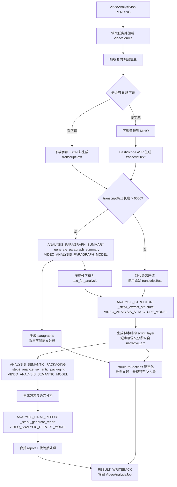

# Video Analysis Worker

这是阶段 2 的独立 Python worker，负责从 `VideoAnalysisJob` 表领取任务、补齐 `VideoSource` 文本来源，并把结构化分析结果回写数据库。

## 目录说明

```text
video-analysis-worker/
  config.py
  db.py
  logging_utils.py
  worker.py
  services/
  prompts/
```

## 本地启动

1. 创建虚拟环境并安装依赖

```bash
python3.9 -m venv .venv
. .venv/bin/activate
pip install -r video-analysis-worker/requirements.txt
patchright install chromium
```

2. 准备配置

- 默认会读取仓库根目录 `.env`
- 可选覆盖 `video-analysis-worker/.env`
- 也支持 `CONFIG_PATH`、根目录 `config.yaml`、`api-server/config.yaml`

3. 启动 worker

```bash
python video-analysis-worker/worker.py
```

## 配置约定

基础配置沿用 API 侧命名，并兼容根目录已有的 `DATABASE_URL`：

- `DB_HOST`
- `DB_PORT`
- `DB_NAME`
- `DB_USER`
- `DB_PASSWORD`
- `DB_SCHEMA`
- `LOG_LEVEL`
- `LOG_DIR`
- `QWEN_MOCK_MODE`
- `QWEN_API_KEY`

Worker 新增配置：

- `VIDEO_ANALYSIS_WORKER_ID`
- `VIDEO_ANALYSIS_POLL_INTERVAL_SECONDS`
- `VIDEO_ANALYSIS_HTTP_TIMEOUT_SECONDS`
- `DASHSCOPE_API_KEY`
- `DASHSCOPE_ASR_MODEL`
- `DASHSCOPE_ASR_TIMEOUT`
- `VIDEO_ANALYSIS_LLM_URL`
- `VIDEO_ANALYSIS_LLM_MODEL`
- `VIDEO_ANALYSIS_PARAGRAPH_MODEL`
- `VIDEO_ANALYSIS_STRUCTURE_MODEL`
- `VIDEO_ANALYSIS_SEMANTIC_MODEL`
- `VIDEO_ANALYSIS_REPORT_MODEL`
- `BILIBILI_COOKIE`
- `BILIBILI_USER_AGENT`
- `MINIO_ENDPOINT`
- `MINIO_PORT`
- `MINIO_USE_SSL`
- `MINIO_ACCESS_KEY`
- `MINIO_SECRET_KEY`
- `MINIO_BUCKET`
- `MINIO_PUBLIC_BASE_URL`

## Bilibili 抓取实现

Worker 内置 `lib/biliapi`，基于 Patchright 启动 Chromium 持久化上下文访问 B 站接口，不再直接使用普通 `requests` 抓取视频元信息与 DASH 音频地址。

- 视频信息：调用 `https://api.bilibili.com/x/web-interface/view` 获取标题、UP 主、封面、时长与分 P `cid`
- 字幕列表：调用 `https://api.bilibili.com/x/player/wbi/v2` 读取 `subtitle.subtitles`，字幕正文仍由 `SubtitleService` 下载 `subtitle_url` JSON 后解析 `body[].content`
- 音频地址：调用 `https://api.bilibili.com/x/player/playurl`，使用 `fnval=4048` 获取 DASH 结构，并选择 `dash.audio` 中带宽最高的音频流
- 登录：保留 `QrCodeLogin`，二维码登录成功后 Cookie 写入 Patchright 持久化 profile，后续请求自动携带；也兼容 `BILIBILI_COOKIE` 作为部署兜底
- 不包含弹幕与 WebSocket 功能

Patchright profile 默认存放在 `video-analysis-worker/.biliapi-profile`，可通过 `BILIAPI_PROFILE_DIR` 覆盖。

## 有头登录字幕下载测试

可用以下脚本先打开有头 Chromium，扫码或网页登录 B 站后下载指定视频字幕：

```bash
python3 video-analysis-worker/scripts/test_biliapi_subtitle_download.py \
  --bvid BVxxxxxxxxxx \
  --output-dir video-analysis-worker/tmp
```

脚本会：

1. 打开 `https://passport.bilibili.com/login`
2. 等待检测到 `SESSDATA` Cookie
3. 调用 `x/web-interface/view` 获取 `cid`
4. 调用 `x/player/wbi/v2` 获取字幕轨道
5. 下载第一条匹配语言的字幕 JSON，并额外导出纯文本

登录态会保存在 Patchright profile 中，后续重复测试通常无需再次扫码。

## 处理顺序

1. 事务领取最早的 `PENDING` 任务并更新为 `PROCESSING`
2. 根据 `normalizedBvid` 拉取 B 站视频基础信息
3. 优先抓字幕
4. 无字幕时先下载音频并上传到 MinIO，再使用 MinIO 匿名公开 URL 走 ASR
5. 将 `transcriptText` 送入结构化分析器
6. 成功回写 `READY`，失败回写 `FAILED`

## 视频分析流程与模型配置

结构化分析由 `services/analyzer.py` 的 `AnalyzerService` 按阶段执行。每个阶段都会写入 `VideoAnalysisJobStageEvent`，并通过 `_model_for_step` 选择模型。

### 1. 文本来源

Worker 会优先使用 B 站字幕：

1. `SNAPSHOT_FETCH`：获取标题、UP 主、封面、时长、`cid` 与字幕轨道。
2. `TRANSCRIPT_RESOLVE`：优先下载字幕 JSON 并写入 `subtitleText` / `transcriptText`。
3. 如果没有字幕，则下载 B 站音频到 MinIO，再把公开 URL 提交给 DashScope ASR，最终写入 `transcriptText`。

### 2. 语义分段来源

前端“语义分段”最终来自 `VideoAnalysisJob.structureSections`，worker 会按字幕长度选择来源：

1. 当完整时间轴文本长度 `> 6000` 字符时，触发 `ANALYSIS_PARAGRAPH_SUMMARY`。
2. `_generate_paragraph_summary` 会把长字幕压缩成 `ParagraphsWrapper.paragraphs`，这些段落会直接派生为前端语义分段。
3. 当完整时间轴文本长度 `<= 6000` 字符时，不触发 `_generate_paragraph_summary`。
4. 短字幕视频会使用 `_step1_extract_structure` 返回的 `narrative_arc` 派生语义分段。
5. 不论来源是哪一个，worker 最后都会做确定性后处理：过多时合并到最多 8 段，长视频过少时拆分到至少 5 段。

`_generate_paragraph_summary.summary` 与 `_step1_extract_structure` 的 `narrative_arc.event` 使用同一类摘要约束：必须包含本段主题或情节、核心观点/结论/冲突，以及本段在整条视频中的作用，不能只写“冲突引入”“历史根源”这类短标签。

### 3. 结构化分析阶段

1. `ANALYSIS_PARAGRAPH_SUMMARY`：仅长字幕触发，用于生成稳定语义分段，并把长字幕压缩成后续分析文本。
2. `ANALYSIS_STRUCTURE`：提取脚本结构，包括开头钩子、内容承诺、段落转折、结构块、金句、CTA、`narrative_arc`。
3. `ANALYSIS_SEMANTIC_PACKAGING`：分析标题封面、心理触发、修辞、互动设计、知识密度和信息过载风险。
4. `ANALYSIS_FINAL_REPORT`：合并前两步结果，生成最终报告、体检卡、元数据和兼容旧字段。
5. `RESULT_WRITEBACK`：把 `summary`、`structureSections`、`highlights`、`copySuggestions`、`healthCard`、`packagingAnalysis`、`scriptAnalysis`、`semanticAnalysis`、`internalizationSummary`、`metadataJson` 写回数据库。

LLM 调用结构如下：



其中 `ANALYSIS_PARAGRAPH_SUMMARY` 是条件步骤，只在长字幕时调用；后面三个 LLM 阶段都会调用。

### 4. 可配置模型

所有模型请求共用 OpenAI-compatible 接口地址：

- `VIDEO_ANALYSIS_LLM_URL`：视频分析 LLM 接口地址，默认 `https://dashscope.aliyuncs.com/compatible-mode/v1/chat/completions`
- `QWEN_API_KEY`：LLM 请求密钥
- `QWEN_MOCK_MODE`：为 `true` 时结构化分析使用本地 mock JSON，不请求外部 LLM

阶段模型配置如下：

| 环境变量 | 默认值 | 使用阶段 | 对应函数 | 用途 |
| --- | --- | --- | --- | --- |
| `VIDEO_ANALYSIS_LLM_MODEL` | `deepseek-v4-flash` | 兜底 | `_model_for_step` | 某个阶段模型未配置时的默认模型 |
| `VIDEO_ANALYSIS_PARAGRAPH_MODEL` | `deepseek-v4-pro` | `ANALYSIS_PARAGRAPH_SUMMARY` | `_generate_paragraph_summary` | 长字幕语义分段与压缩摘要 |
| `VIDEO_ANALYSIS_STRUCTURE_MODEL` | `deepseek-v4-flash` | `ANALYSIS_STRUCTURE` | `_step1_extract_structure` | 脚本结构、短字幕语义分段来源、结构块与金句 |
| `VIDEO_ANALYSIS_SEMANTIC_MODEL` | `deepseek-v4-flash` | `ANALYSIS_SEMANTIC_PACKAGING` | `_step2_analyze_semantic_packaging` | 标题封面、传播心理、语义机制 |
| `VIDEO_ANALYSIS_REPORT_MODEL` | `deepseek-v4-flash` | `ANALYSIS_FINAL_REPORT` | `_step3_generate_report` | 最终报告与元数据生成 |

配置建议：

- 语义分段不稳定时，优先调高 `VIDEO_ANALYSIS_PARAGRAPH_MODEL` 或 `VIDEO_ANALYSIS_STRUCTURE_MODEL`。
- 长视频语义分段主要看 `VIDEO_ANALYSIS_PARAGRAPH_MODEL`。
- 短视频语义分段主要看 `VIDEO_ANALYSIS_STRUCTURE_MODEL`。
- 标题封面和传播机制质量主要看 `VIDEO_ANALYSIS_SEMANTIC_MODEL`。
- 最终总结、体检卡和元数据质量主要看 `VIDEO_ANALYSIS_REPORT_MODEL`。
- 如果只想快速降低成本，可以只配置 `VIDEO_ANALYSIS_LLM_MODEL`，并让其他阶段变量留空回落到同一模型。

## Mock 说明

- `QWEN_MOCK_MODE=true` 时：
  - 无字幕视频会走模拟 ASR 文本
  - 结构化分析会返回稳定的本地 mock JSON
- 该模式主要用于本地联调数据库状态流转与接口回写，不依赖外部模型服务
- 该模式仍需要访问 B 站公开接口获取视频元信息、字幕列表和音频地址
